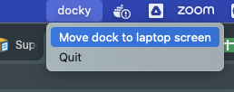

# go-docky



Utility to restore Dock position on the laptop main screen for MacOS in Golang.

## Install

This command install go-docky locally (in `$GOPATH/bin`)

```sh
go install github.com/jtbonhomme/go-docky
```

## Execute

This command installs go-docky as a service.

```sh
$GOPATH/bin/go-docky
```

## Usage

In the menu bar, select the `docky` item and:
* `Move dock to laptop screen` option
* `Quit` option

